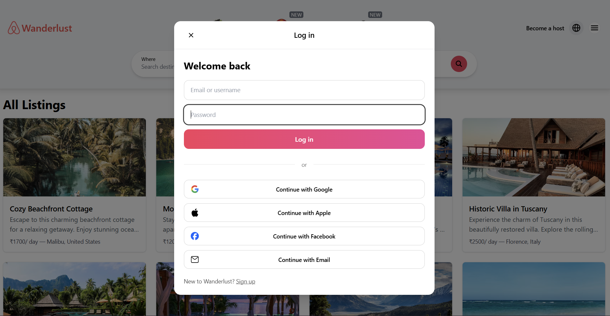

# Wanderlust – Airbnb Clone (MERN Stack)

A full-stack Airbnb-inspired web application built with the **MERN stack** (MongoDB, Express.js, React, Node.js) and deployed on **Render**.  

Features **secure authentication & authorization** with session-based login, **protected routes**, and **ownership checks** (only listing/review owners can edit or delete their content). Users can create, edit, and delete listings, upload images via **Cloudinary**, add reviews, and manage their accounts.

---

## Live Demo
- **Frontend**: [https://wanderlust-1-wl7b.onrender.com](https://wanderlust-1-wl7b.onrender.com)  
- **Backend API**: [https://wanderlust-we4g.onrender.com](https://wanderlust-we4g.onrender.com)

## Demo Login
- Username: demo01
- email: demo@gmail.com
- Password: 12345

---

## Table of Contents
- [Live Demo](#live-demo)
- [Demo Login](#demo-login)
- [Features](#features)
- [Tech Stack](#tech-stack)
- [Folder Structure](#folder-structure)
- [Getting Started](#getting-started)
- [Screenshots](#screenshots)
- [Future Improvements](#future-improvements)
- [Author](#author)

## Features

- **Authentication & Authorization**
  - Session-based authentication with **Passport.js**.
  - **Protected routes**: only logged-in users can access/create listings or reviews.
  - **Ownership checks**:
    - Only listing owners can edit or delete their own listings.
    - Only review owners can delete their own reviews.

- **Listings**
  - Create, view, edit, and delete property listings.
  - Upload images using **Cloudinary**.
  - Listings tied to their respective owners.
 
- **Reviews**
  - Add reviews on listings.
  - Delete reviews (only by the author).
  - Automatically linked with listings and users.
 
- **User Management**
  - Persistent login using cookies (`connect.sid`).
  - Logout clears the session securely.
 
- **Deployment**
  - **Backend**: Node/Express API hosted on Render.
  - **Frontend**: React (Vite) hosted on Render.
  - **Database**: MongoDB Atlas.
  - **Images**: Cloudinary.

---

## Tech Stack

**Frontend**
- React (Vite)
- Axios (with `withCredentials` for sessions)
- React Router DOM
- Tailwind CSS

**Backend**
- Node.js, Express.js
- Passport.js & passport-local-mongoose
- express-session & connect-mongo
- Multer + Cloudinary SDK

**Database**
- MongoDB Atlas

**Deployment**
- Render (Frontend + Backend)
- Environment variables for secrets

---

##  Folder Structure

```plaintext
Wanderlust/
│
├── backend/                # Express backend (API + authentication + DB models)
|   ├── controllers/        # Route controllers (listings, users, reviews)
|   ├── init/               # Starter data (data, index)
|   ├── middlewares/        # Custom middlewares (auth, validation, ownership)
|   ├── models/             # Mongoose models (User, Listing, Review)
│   ├── routes/             # Express route definitions
│   ├── .env                # Backend environment variable
|   ├── app.js              # Main Express app
│   └── cloudConfig.js      # Cloudinary setup
│
├── frontend/               # React (Vite) frontend
|    ├── public/            # images
│   ├── src/
│   │   ├── components/     # Reusable React components (Footer, LoginModel, Navbar, ProtectedRoute, Review)
│   │   ├── context/        # AuthContext (user auth state)
|   |   ├── css/            # custom css
|   |   ├── hooks/          # useMe 
│   │   ├── pages/          # Page-level components (Home, Listings,  Expericece, Service, NotFound, etc)
│   │   ├── axiosConfig.js  # Axios instance with baseURL
|   |   ├── index.css       # tailwind css module/ custom css
|   |   ├── main.jsx        # Root React App
│   │   └── App.jsx         # Main React app
|   ├── index.html          # html file
|   ├── tailwind css    # tailwind css related files
│   └── .env                # Frontend environment variables
│
└── README.md
```
---

## Getting Started
### 1. Clone the repository
```bash
git clone https://github.com/Ritik-Thakur-sudo/Wanderlust.git
cd Wanderlust
```
### 2. Install dependencies
 - **Backend**
```bash
cd backend
npm install
```
- **Frontend**
```bash
cd frontend
npm install
```
### 3. Setup environment variables
- Create a .env file inside the backend/ folder:

  - PORT=8080
  - NODE_ENV=development
  - MONGO_URL=mongodb://127.0.0.1:27017/wanderlust
  -  ATLASDB_URL=your_mongo_atlas_url
  - SESSION_SECRET=your_secret_key
  - FRONTEND_ORIGIN=http://localhost:5173

  - CLOUD_NAME=your_cloudinary_name
  - CLOUD_API_KEY=your_cloudinary_api_key
  - CLOUD_API_SECRET=your_cloudinary_secret

- And inside the frontend/ folder, add:
   - VITE_BACKEND_URL=http://localhost:8080

### 4️. Run the app locally
 - **Backend**
```bash
cd backend
npm start
```
 - **Frontend**
```bash
cd frontend
npm run dev
```
- The app will be available at:
  - Frontend → http://localhost:5173
  - Backend → http://localhost:8080
 
---

## Screenshots

### Home Page


### Signup & Login





### Dashboard


### Listings


### Reviews


### Create a Listing


### Edit a Listing


---


## Future Improvements

  - Google/Facebook OAuth login

  -  Search & filtering listings

  -  Booking/reservation system

  - Email verification & password reset

  - Maps integration for listing locations

---

## Author
  - Built by Ritik Thakur
